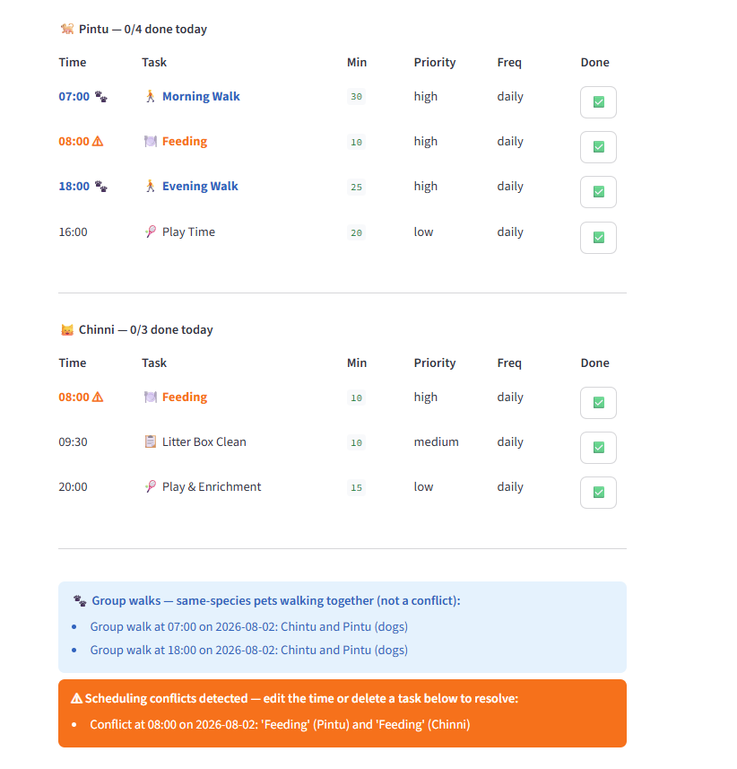
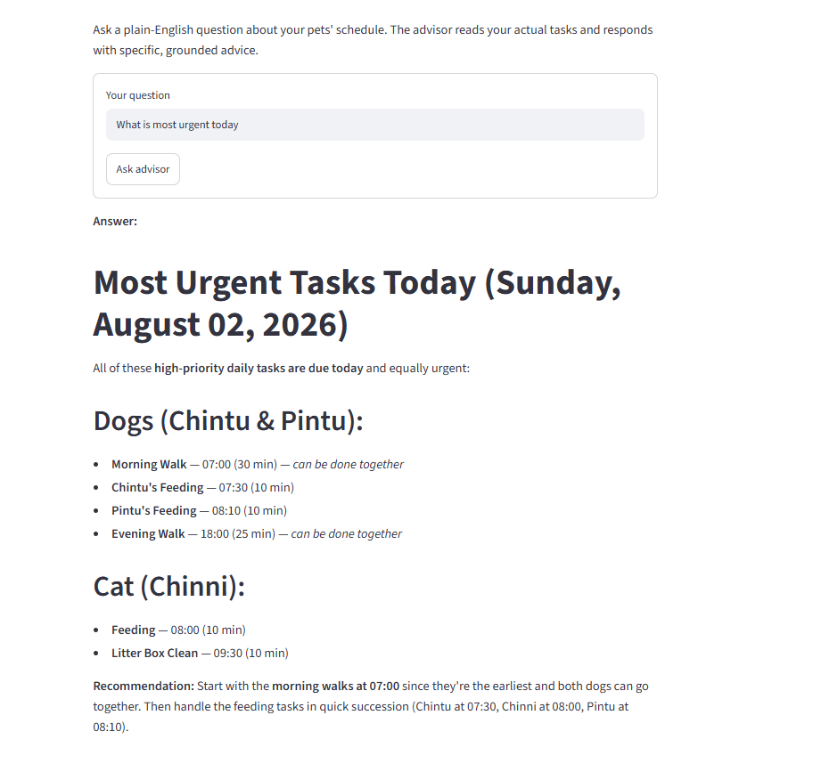

# PawPal+ — Applied AI Pet Care Scheduler

> **Final project for AI110 | Foundations of AI Engineering — Module 4**
> Built on top of [ai110-module2show-pawpal-starter](https://github.com/abhishek-dhall/ai110-module2show-pawpal-starter), which established the four-class scheduling backend (`Task`, `Pet`, `Owner`, `Scheduler`) and a working Streamlit UI. This final project extends that foundation with an AI-powered care advisor, smarter conflict detection, group walk recognition, and persistent user profiles.

**PawPal+** is a Streamlit app that helps a pet owner stay consistent with daily pet care. Add your pets, schedule their tasks, and get a conflict-checked priority schedule — then ask the built-in AI advisor questions about your pets' day in plain English.

---

## What it does

- **Saved user profiles** — Owner and pet data loads from `data/users.json` at startup. One click restores your full profile — no re-entering names every session.
- **Collapsible setup sections** — Step 2 (Add a Pet) and Step 3 (Add a Task) collapse automatically once data is loaded, keeping the schedule views front and centre. Step 2 shows how many pets are saved in the header; Step 3 shows the total task count. Either section can be expanded any time to add or edit.
- **Owner setup** — Enter your name once; the app locks it in and greets you by name for the rest of the session.
- **Multi-pet support** — Add as many pets as you like (dogs, cats, rabbits, birds, fish, hamsters, or other). Each pet has its own task list.
- **Task scheduling** — Add tasks with a name, time (HH:MM), duration, priority, and frequency (once / daily / weekly). Duplicate tasks at the same time are blocked automatically.
- **Delete tasks** — Remove any task directly from the task list — the primary way to resolve a scheduling conflict.
- **Exact conflict detection** — Tasks that share the same time slot are flagged in **orange ⚠** in both the task list and the generated schedule.
- **Duration-overlap detection** — Tasks whose time windows overlap (even with different start times) are also flagged — e.g. a 60-min walk at 07:30 and a vet at 08:00 are caught.
- **Group walk recognition** — When two or more pets of the same species both have a walk scheduled at the same time, the rows are highlighted in **blue 🐾** instead of orange — cooperative scheduling, not a conflict.
- **Recurring tasks** — Daily and weekly tasks automatically generate the next occurrence when marked complete.
- **Daily schedule (Step 4)** — The core view: one click shows only today's tasks sorted by priority then time, with conflict and group walk highlighting. No date column needed — everything is happening today.
- **Weekly schedule (Step 5, additional feature)** — An enhanced view that shows all tasks across the week: daily tasks on today's date, weekly tasks placed on the next Saturday. Each row shows the date so you can plan ahead. Sorted by date first, then priority.
- **Priority-first schedule** — One click generates a full cross-pet schedule sorted by priority (high → medium → low), then by time within each tier.
- **Smart emoji labels** — Pet names show a species icon (🐕 🐈 🐇 🦜 🐠 🐹); task names show a type icon (🚶 walk, 🍽️ feed, 💊 meds, 🏥 vet, ✂️ groom, 🎾 play) inferred from the task name.
- **AI Care Advisor** — Ask natural-language questions about your pets' schedule and get answers grounded in your actual data, powered by Claude.

---

## Getting started

```bash
# 1. Clone and create a virtual environment
python -m venv .venv
.venv\Scripts\activate        # Windows
pip install -r requirements.txt

# 2. Set your Anthropic API key (needed for the AI advisor in Step 5)
cp .env.example .env
# Open .env and set: ANTHROPIC_API_KEY=your-key-here

# 3. Launch the app
streamlit run app.py          # opens http://localhost:8501
```

> The app works fully without an API key — the AI advisor (Step 5) will show a warning if the key is missing, but all scheduling features remain available.

---

## 🤖 Sample AI Advisor Interactions

> These are real outputs from the live app with Abhishek's pets (Chintu 🐕, Pintu 🐕, Chinni 🐈) loaded.

**Q: What's most urgent for my dogs today?**
```
Based on your schedule, here are the high-priority tasks due today for Chintu and Pintu:

Daily High-Priority Tasks:
1. Morning Walk – 07:00 (30 min) – Both dogs
2. Feeding – 07:30 (Chintu) & 08:00 (Pintu) – 10 min each
3. Evening Walk – 18:00 (25 min) – Both dogs

Good news: You can do the morning and evening walks together since both dogs need them at the same time!

Upcoming High-Priority:
- Pintu's Vet Checkup – due 2026-08-05 at 10:30 (60 min)

The daily walks and feeding are your most time-sensitive items today.
```

**Q: Can Chintu and Pintu do their morning walk together?**
```
Yes! Chintu and Pintu can do their morning walk together. Both are scheduled for a
morning walk at 07:00 for 30 minutes on a daily basis. Since they're both dogs,
a group walk is practical and efficient. This would actually resolve the scheduling
conflict at that time slot.

Suggestion: Schedule them as a combined "Morning Walk (Chintu & Pintu)" at 07:00
for 30 minutes daily instead of two separate tasks.
```

**Q: Are there any scheduling conflicts I should fix?**
```
Yes, there are 3 scheduling conflicts to address:

1. 07:00 – Morning Walk (Chintu & Pintu)
   Both dogs are scheduled simultaneously for 30 minutes.
   Fix: This is actually fine! A group walk with both dogs together works well.

2. 18:00 – Evening Walk (Chintu & Pintu)
   Both dogs scheduled simultaneously for 25 minutes.
   Fix: Again, a group walk works here too.

3. 08:00 – Feeding (Pintu & Chinni)
   Pintu (dog) and Chinni (cat) feeding overlap.
   Fix: Move one feeding time — shift Pintu's feeding to 07:45 (right after his
   morning walk ends at 07:30) or Chinni's feeding to 08:15.

Summary: The dog walks can stay as group walks, but adjust one of the 08:00
feedings by 15–30 minutes.
```

---

## 🧪 Testing

Run the full test suite from the project root:

```bash
python -m pytest tests/test_pawpal.py -v
```

**What the tests cover:**
- **Sorting correctness** — tasks return in chronological HH:MM order; priority sort puts high before medium before low
- **Exact conflict detection** — duplicate time slots flagged with pet names in the message (e.g. `'Feeding' (Pintu) and 'Feeding' (Chinni)`)
- **Duration-overlap detection** — overlapping windows caught even with different start times; touching-but-not-overlapping tasks are not flagged
- **Group walk recognition** — same-species pets with a walk at the same slot → group walk; different-species or different-time walks → not flagged
- **Recurrence logic** — daily/weekly tasks create the next occurrence after completion; `once` tasks do not
- **Filter by status** — only incomplete (or complete) tasks are returned
- **Filter by pet** — name matching is case-insensitive
- **Task removal** — `remove_task()` returns `True` on success and `False` when name/time doesn't match
- **Edge cases** — empty pet, already-completed task, no match on pet filter, different dates don't cause false overlaps

```
$ python -m pytest tests/test_pawpal.py -v
============================= test session starts =============================
platform win32 -- Python 3.14.2, pytest-9.1.1, pluggy-1.6.0
collected 25 items

tests/test_pawpal.py::test_task_mark_complete PASSED                     [  4%]
tests/test_pawpal.py::test_pet_task_count_increases_on_add PASSED        [  8%]
tests/test_pawpal.py::test_sort_by_time_orders_chronologically PASSED    [ 12%]
tests/test_pawpal.py::test_sort_by_time_empty_pet PASSED                 [ 16%]
tests/test_pawpal.py::test_detect_conflicts_same_time_flags_warning PASSED [ 20%]
tests/test_pawpal.py::test_detect_conflicts_different_times_no_warning PASSED [ 24%]
tests/test_pawpal.py::test_handle_recurrence_daily_creates_next_day PASSED [ 28%]
tests/test_pawpal.py::test_handle_recurrence_weekly_creates_seven_days_later PASSED [ 32%]
tests/test_pawpal.py::test_handle_recurrence_once_does_not_add_task PASSED [ 36%]
tests/test_pawpal.py::test_filter_by_status_returns_only_incomplete PASSED [ 40%]
tests/test_pawpal.py::test_filter_by_pet_case_insensitive PASSED         [ 44%]
tests/test_pawpal.py::test_mark_complete_twice_stays_true PASSED         [ 48%]
tests/test_pawpal.py::test_handle_recurrence_not_complete_does_nothing PASSED [ 52%]
tests/test_pawpal.py::test_filter_by_pet_no_match_returns_empty PASSED   [ 56%]
tests/test_pawpal.py::test_detect_conflicts_message_includes_pet_names PASSED [ 60%]
tests/test_pawpal.py::test_detect_group_walks_same_species_returns_result PASSED [ 64%]
tests/test_pawpal.py::test_detect_group_walks_different_species_not_a_group_walk PASSED [ 68%]
tests/test_pawpal.py::test_detect_group_walks_single_pet_not_a_group_walk PASSED [ 72%]
tests/test_pawpal.py::test_detect_group_walks_same_species_different_times_no_result PASSED [ 76%]
tests/test_pawpal.py::test_detect_overlap_conflicts_catches_overlapping_windows PASSED [ 80%]
tests/test_pawpal.py::test_detect_overlap_conflicts_sequential_tasks_no_warning PASSED [ 84%]
tests/test_pawpal.py::test_detect_overlap_conflicts_different_dates_no_warning PASSED [ 88%]
tests/test_pawpal.py::test_sort_by_priority_then_time_high_before_medium_before_low PASSED [ 92%]
tests/test_pawpal.py::test_remove_task_returns_true_and_decreases_count PASSED [ 96%]
tests/test_pawpal.py::test_remove_task_nonexistent_returns_false PASSED  [100%]

============================= 25 passed in 0.10s ==============================
```

**Confidence level: ⭐⭐⭐⭐⭐ (5/5)**
All core scheduling behaviors are tested, including the two new Scheduler methods. AI advisor responses are verified manually via live interaction logs in `logs/advisor_log.txt`.

---

## 📐 Scheduling Features

| Feature | Method | Notes |
|---------|--------|-------|
| Sort by time | `Scheduler.sort_by_time()` | All tasks sorted chronologically by HH:MM string |
| Sort by priority, then time | `Scheduler.sort_by_priority_then_time()` | High-priority tasks first; time is tiebreaker within each tier |
| Filter by status | `Scheduler.filter_by_status(completed)` | Returns only completed or only incomplete tasks |
| Filter by pet | `Scheduler.filter_by_pet(pet_name)` | Case-insensitive match on pet name |
| Exact conflict detection | `Scheduler.detect_conflicts()` | Flags tasks sharing the same scheduled_time + due_date |
| Duration-overlap detection | `Scheduler.detect_overlap_conflicts()` | Flags tasks whose time windows overlap even with different start times |
| Group walk recognition | `Scheduler.detect_group_walks()` | Same-species pets with walk tasks at the same slot → blue 🐾 badge |
| Daily schedule | Step 4 in `app.py` | Filters to today's tasks only — the primary daily-use view |
| Weekly schedule | Step 5 in `app.py` (additional feature) | All tasks with Date column; weekly tasks placed on next Saturday |
| Recurring tasks | `Scheduler.handle_recurrence(task, pet)` | Daily +1 day; weekly +7 days; `once` tasks not re-created |
| Delete a task | `Pet.remove_task(name, scheduled_time)` | Removes by name + time match; primary conflict resolution path |
| Orange conflict highlight | UI — `app.py` | Conflicting rows in orange bold ⚠ in task list and schedule |
| Blue group walk highlight | UI — `app.py` | Group walk rows in blue 🐾 in task list and schedule |
| Species emoji | UI — `app.py` `species_emoji()` | 🐕 🐈 🐇 🦜 🐠 🐹 🐾 — auto-applied everywhere |
| Task type emoji | UI — `app.py` `task_emoji()` | 🚶 🍽️ 💊 🏥 ✂️ 🎾 📋 — inferred from task name keyword |
| AI Care Advisor | `ai_advisor.ask_advisor()` | Claude answers questions using live schedule as context |
| Saved user profiles | `data/users.json` | Owner + pets persist across sessions; loaded at Step 1 |

---

## 📸 Demo Walkthrough

**Step 1 — Load your profile or set your name**
If saved user data is found, the app shows a "Load [name]'s data" button. One click restores your owner profile and all pets — skip re-entering everything every session.


---

**Step 2 — Add a pet**
Enter a pet name and species (dog, cat, rabbit, bird, fish, hamster, or other), then click **Add pet**. All added pets appear above the form.


---

**Step 3 — Add tasks**
Select which pet, fill in the task name, time (HH:MM), duration, priority, and frequency, then click **Add task**. Each task row has ✏️ edit, ✅ complete, and 🗑 delete buttons.


---

**Conflict highlight — orange ⚠**
Tasks sharing the same time slot are flagged in orange. The conflict banner tells you to edit the time or delete a task to resolve.



---

**Group walk highlight — blue 🐾**
Same-species pets with a walk at the same time slot turn blue — cooperative scheduling, not a conflict.


---

**Edit to resolve**
Click ✏️ on a conflicting task to change its time inline — no need to delete and re-add.


---

**Step 4 — Generate today's schedule**
One click filters to tasks due today and produces a clean daily view sorted by priority then time. Conflicting rows stay orange; group walk rows show blue. No date column needed — everything is today.

**Step 5 — Generate the weekly schedule**
Shows all tasks across the week — daily tasks on today's date, weekly tasks on the next Saturday — with a Date column so you can see at a glance what's coming up. Sorted by date first, then priority.

**Step 6 — Ask your AI advisor**
Type a plain-English question. The advisor reads your current schedule and responds with grounded, specific advice.



---

### Example workflow

1. Open the app → click **Load Abhishek's data** → Chintu, Pintu, and Chinni are instantly loaded
2. Add tasks for each pet — walks, feeding, vet appointments
3. If Chintu and Pintu both have a morning walk at 07:30, the row turns **blue 🐾** (group walk)
4. If a vet at 07:45 overlaps Pintu's 30-min walk, the overlap is flagged **orange ⚠**
5. Click **Generate schedule** → priority-sorted, conflict-highlighted full schedule
6. Ask the advisor: *"What's most urgent for Chintu today?"* → Claude answers using the live schedule

---

## 🏗️ Architecture

### System overview

Full Mermaid source: [`diagrams/architecture.mmd`](diagrams/architecture.mmd)
Full UML class diagram: [`diagrams/uml_final.mmd`](diagrams/uml_final.mmd)

Five modules work together:

| Module | Role |
|--------|------|
| `pawpal_system.py` | Core backend — `Task`, `Pet`, `Owner`, `Scheduler` classes |
| `app.py` | Streamlit UI — 5-step flow connecting user input to backend logic |
| `ai_advisor.py` | AI integration — builds schedule context, calls Claude API, logs interactions |
| `data/users.json` | Persistent user profiles — owner name and pet roster across sessions |
| `logs/advisor_log.txt` | Interaction log — every AI query and response with timestamp |

UML diagrams: [`diagrams/uml.mmd`](diagrams/uml.mmd) (initial design) and [`diagrams/uml_final.mmd`](diagrams/uml_final.mmd) (final implementation with new Scheduler methods).

---

## 🧩 Design Decisions

- **HH:MM string for time, not datetime** — Keeps the data model simple and lets Python's default string sort order handle chronological sorting correctly for times within a single day. A full `datetime` object would be necessary for multi-day scheduling but adds complexity that isn't needed here.
- **JSON for user profiles, not a database** — A flat JSON file is readable, version-controllable, and has zero infrastructure dependencies. For a single-user scheduling tool, a database would be over-engineering.
- **Two conflict detectors, not one** — `detect_conflicts()` (exact match) was in Module 2 and all its tests pass. `detect_overlap_conflicts()` was added as an enhancement without touching the original — they run side by side, each catching what the other misses.
- **3-state rendering, not binary conflict/no-conflict** — The initial AI-generated implementation flagged any two tasks sharing a time slot as a conflict (orange ⚠). Human review caught that two dogs walking together at the same time is cooperative scheduling, not a problem. This required a third state — blue 🐾 for group walks — and a new `detect_group_walks()` method. The AI's purely mechanical approach needed domain knowledge from the human to get right. Full write-up in [`model_card.md`](model_card.md).
- **Claude Haiku for the AI advisor** — Fast response times and low cost make it practical for interactive Q&A in a scheduling tool. The context window is small enough (one owner's schedule) that a larger model adds no benefit.
- **RAG via in-memory context, not a vector store** — The owner's full schedule is small enough to format as plain text and inject directly into the prompt. A vector database would be necessary only if the context grew to thousands of tasks.

---

## 📊 Testing Summary

```
============================= 25 passed in 0.10s ==============================
```

**25 / 25 tests passing** (target: 20+ ✓). Core scheduling logic (sort, filter, conflict detection, recurrence) is fully covered by automated tests. The two new Scheduler methods (`detect_group_walks`, `detect_overlap_conflicts`) each have 3–4 dedicated test cases covering the positive case, negative cases, and edge cases. AI advisor responses are not unit-tested — they are verified manually through the interaction log at `logs/advisor_log.txt`.

---

## 🚀 Stretch Features

### RAG-Powered Context (implemented — +2 points)

The AI advisor uses **Retrieval-Augmented Generation (RAG)** to ground every response in the owner's live schedule. Rather than answering from general pet-care knowledge, the system builds a structured context block at query time and injects it into the Claude prompt as the user message preamble:

```
Today's date: Sunday, August 02, 2026
Owner: Abhishek
Pets: Chintu (dog), Pintu (dog), Chinni (cat)

Chintu's tasks:
  - Morning Walk at 07:00 (30 min, high priority, daily, due 2026-08-02)
  - Feeding at 07:30 (10 min, high priority, daily, due 2026-08-02)
  ...

Scheduling conflicts detected:
  - Overlap: Feeding (Pintu) and Feeding (Chinni) at 08:00 on 2026-08-02
```

The model is told to answer only from this context, not from general knowledge. This means responses reference real pet names, real times, and real conflicts — not generic advice.

### AI Advisor Test Harness (implemented — +2 points)

`eval_advisor.py` is an automated evaluation script that runs the live advisor against 5 pre-defined questions and checks each response for expected keywords. It loads the real user profile, calls `ask_advisor()`, and prints a pass/fail scored summary.

Run it from the project root:

```bash
python eval_advisor.py
```

**Eval output (2026-08-02 run):**

```
============================================================
PawPal+ AI Advisor — Evaluation Harness
============================================================
Profile loaded: Abhishek — 3 pets, 15 tasks

Test 1: Identifies high-priority dog tasks with pet names
  Q: What is most urgent for my dogs today?
  PASS — keywords matched: ['chintu', 'pintu', 'walk', 'feeding', 'high']

Test 2: Recognises group walk opportunity at 07:00
  Q: Can Chintu and Pintu do their morning walk together?
  PASS — keywords matched: ['together', '07:00', 'group']

Test 3: Identifies the 08:00 feeding conflict with pet names
  Q: Are there any scheduling conflicts I should fix?
  PASS — keywords matched: ['08:00', 'feeding', 'pintu', 'chinni']

Test 4: Returns Chinni's specific tasks
  Q: What tasks are scheduled for Chinni today?
  PASS — keywords matched: ['chinni', 'feeding', 'litter']

Test 5: Finds upcoming vet appointments across pets
  Q: Which pet has a vet appointment coming up?
  PASS — keywords matched: ['vet', 'pintu', 'chinni']

============================================================
Results: 5/5 passed

  ✓  Identifies high-priority dog tasks with pet names
  ✓  Recognises group walk opportunity at 07:00
  ✓  Identifies the 08:00 feeding conflict with pet names
  ✓  Returns Chinni's specific tasks
  ✓  Finds upcoming vet appointments across pets
============================================================
All tests passed — advisor is grounded in schedule data.
```

Full eval log saved to `logs/eval_log.txt`. The harness skips tests gracefully if the API key is missing, making it safe to run in offline environments.

---

## 💭 Reflection

Building PawPal+ into a full AI system reinforced that the hardest part isn't the API call — it's constructing a context that gives the model enough information to be genuinely useful rather than generically helpful. The AI advisor is only as good as the schedule data injected into the prompt; a well-structured context makes the difference between "walk your dog" and "Chintu's morning walk at 07:30 is your top priority today."

> The graded responsible-AI reflection — how AI was used to build this project, one helpful suggestion, one flawed suggestion, and system limitations — is in [`model_card.md`](model_card.md).
