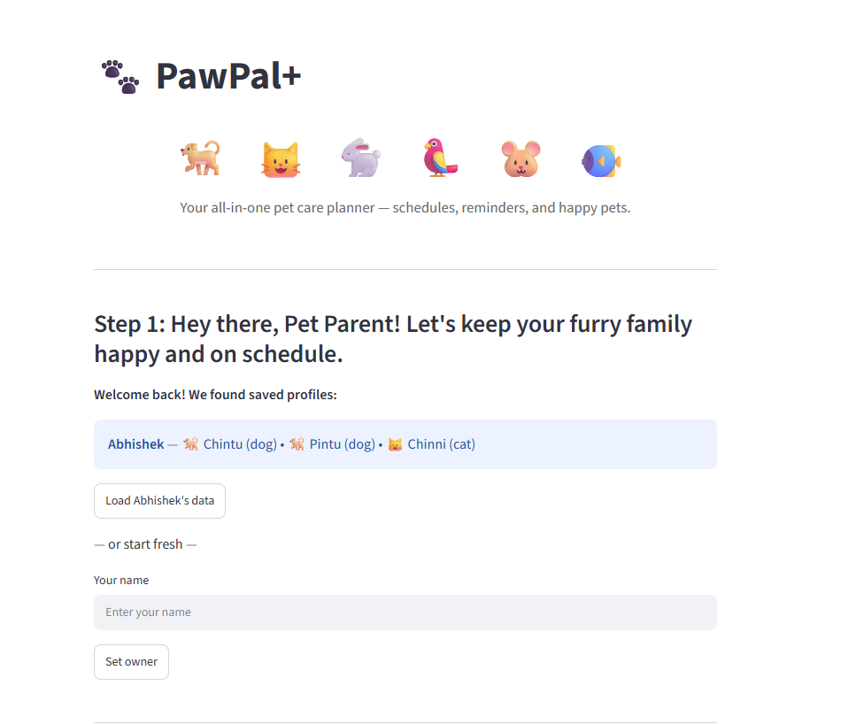
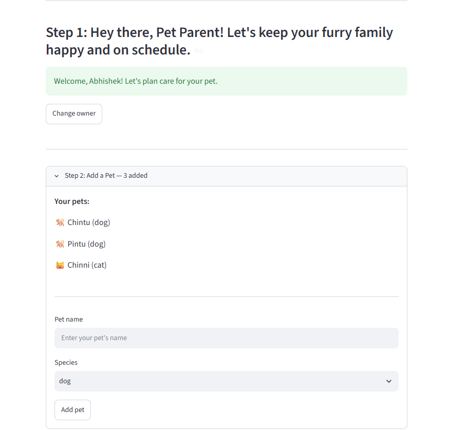
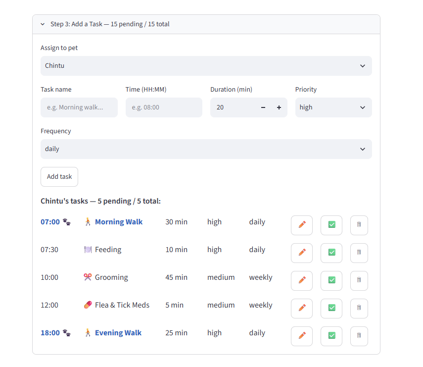
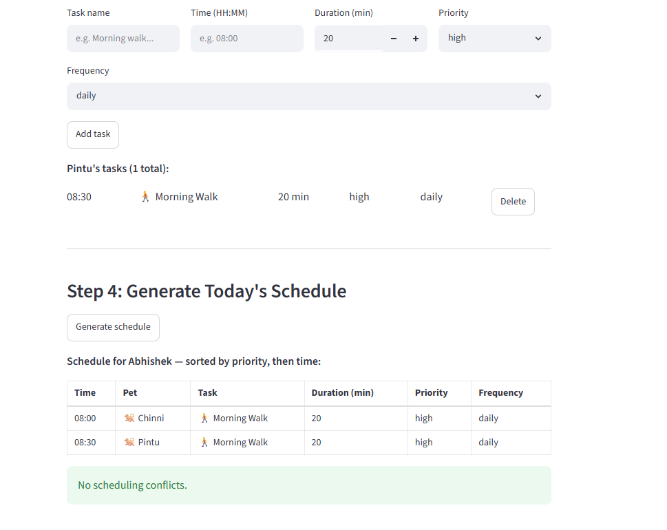
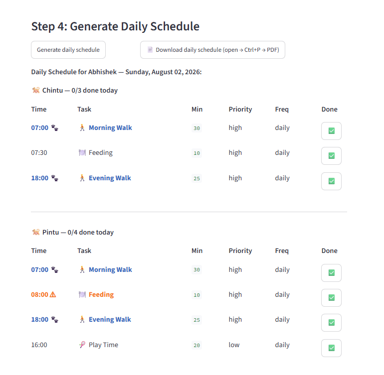
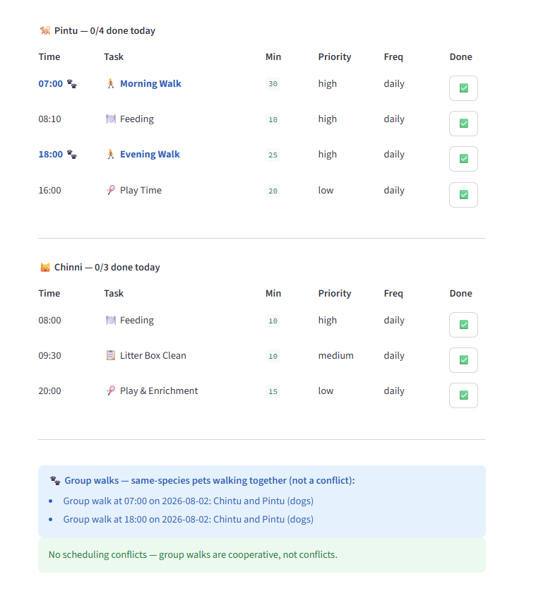

# PawPal+ — Applied AI Pet Care Scheduler

> **Final project for AI110 | Foundations of AI Engineering — Module 4**
> Built on top of [ai110-module2show-pawpal-starter](https://github.com/abhishek-dhall/ai110-module2show-pawpal-starter), which established the four-class scheduling backend (`Task`, `Pet`, `Owner`, `Scheduler`) and a working Streamlit UI. This final project extends that foundation with an AI-powered care advisor, smarter conflict detection, group walk recognition, and persistent user profiles.

**PawPal+** is a Streamlit app that helps a pet owner stay consistent with daily pet care. Add your pets, schedule their tasks, and get a conflict-checked priority schedule — then ask the built-in AI advisor questions about your pets' day in plain English.

---

## What it does

- **Saved user profiles** — Owner and pet data loads from `data/users.json` at startup. One click restores your full profile — no re-entering names every session.
- **Owner setup** — Enter your name once; the app locks it in and greets you by name for the rest of the session.
- **Multi-pet support** — Add as many pets as you like (dogs, cats, rabbits, birds, fish, hamsters, or other). Each pet has its own task list.
- **Task scheduling** — Add tasks with a name, time (HH:MM), duration, priority, and frequency (once / daily / weekly). Duplicate tasks at the same time are blocked automatically.
- **Delete tasks** — Remove any task directly from the task list — the primary way to resolve a scheduling conflict.
- **Exact conflict detection** — Tasks that share the same time slot are flagged in **orange ⚠** in both the task list and the generated schedule.
- **Duration-overlap detection** — Tasks whose time windows overlap (even with different start times) are also flagged — e.g. a 60-min walk at 07:30 and a vet at 08:00 are caught.
- **Group walk recognition** — When two or more pets of the same species both have a walk scheduled at the same time, the rows are highlighted in **blue 🐾** instead of orange — cooperative scheduling, not a conflict.
- **Recurring tasks** — Daily and weekly tasks automatically generate the next occurrence when marked complete.
- **Priority-first schedule** — One click generates a full cross-pet schedule sorted by priority (high → medium → low), then by time within each tier.
- **Smart emoji labels** — Pet names show a species icon (🐕 🐈 🐇 🦜 🐠 🐹); task names show a type icon (🚶 walk, 🍽️ feed, 💊 meds, 🏥 vet, ✂️ groom, 🎾 play) inferred from the task name.
- **AI Care Advisor** — Ask natural-language questions about your pets' schedule and get answers grounded in your actual data, powered by Claude.

---

## Getting started

```bash
# 1. Clone and create a virtual environment
python -m venv .venv
.venv\Scripts\activate        # Windows
pip install -r requirements.txt

# 2. Set your Anthropic API key (needed for the AI advisor in Step 5)
cp .env.example .env
# Open .env and set: ANTHROPIC_API_KEY=your-key-here

# 3. Launch the app
streamlit run app.py          # opens http://localhost:8501
```

> The app works fully without an API key — the AI advisor (Step 5) will show a warning if the key is missing, but all scheduling features remain available.

---

## 🤖 Sample AI Advisor Interactions

> These are real outputs from the live app with Abhishek's pets (Chintu 🐕, Pintu 🐕, Chinni 🐈) loaded.

**Q: What's most urgent for my dogs today?**
```
[TODO: paste real output here after ai_advisor.py is built]
```

**Q: Can Chintu and Pintu do their morning walk together?**
```
[TODO: paste real output here after ai_advisor.py is built]
```

**Q: Help me fix a scheduling conflict at 08:00**
```
[TODO: paste real output here after ai_advisor.py is built]
```

---

## 🧪 Testing

Run the full test suite from the project root:

```bash
python -m pytest tests/test_pawpal.py -v
```

**What the tests cover:**
- **Sorting correctness** — tasks return in chronological HH:MM order
- **Exact conflict detection** — duplicate time slots are flagged with a warning
- **Duration-overlap detection** — tasks whose windows overlap are caught even with different start times
- **Group walk recognition** — same-species pets with walk tasks at the same slot return a group walk, not a conflict
- **Recurrence logic** — daily/weekly tasks create the next occurrence after completion; `once` tasks do not
- **Filter by status** — only incomplete (or complete) tasks are returned
- **Filter by pet** — name matching is case-insensitive
- **Edge cases** — empty pet, already-completed task, no match on pet filter

```
[TODO: paste updated pytest -v output here after new tests are written]
Expected: 20+ tests, all passing
```

**Confidence level: ⭐⭐⭐⭐⭐ (5/5)**
All core scheduling behaviors are tested, including the two new Scheduler methods. AI advisor responses are verified manually via live interaction logs in `logs/advisor_log.txt`.

---

## 📐 Scheduling Features

| Feature | Method | Notes |
|---------|--------|-------|
| Sort by time | `Scheduler.sort_by_time()` | All tasks sorted chronologically by HH:MM string |
| Sort by priority, then time | `Scheduler.sort_by_priority_then_time()` | High-priority tasks first; time is tiebreaker within each tier |
| Filter by status | `Scheduler.filter_by_status(completed)` | Returns only completed or only incomplete tasks |
| Filter by pet | `Scheduler.filter_by_pet(pet_name)` | Case-insensitive match on pet name |
| Exact conflict detection | `Scheduler.detect_conflicts()` | Flags tasks sharing the same scheduled_time + due_date |
| Duration-overlap detection | `Scheduler.detect_overlap_conflicts()` | Flags tasks whose time windows overlap even with different start times |
| Group walk recognition | `Scheduler.detect_group_walks()` | Same-species pets with walk tasks at the same slot → blue 🐾 badge |
| Recurring tasks | `Scheduler.handle_recurrence(task, pet)` | Daily +1 day; weekly +7 days; `once` tasks not re-created |
| Delete a task | `Pet.remove_task(name, scheduled_time)` | Removes by name + time match; primary conflict resolution path |
| Orange conflict highlight | UI — `app.py` | Conflicting rows in orange bold ⚠ in task list and schedule |
| Blue group walk highlight | UI — `app.py` | Group walk rows in blue 🐾 in task list and schedule |
| Species emoji | UI — `app.py` `species_emoji()` | 🐕 🐈 🐇 🦜 🐠 🐹 🐾 — auto-applied everywhere |
| Task type emoji | UI — `app.py` `task_emoji()` | 🚶 🍽️ 💊 🏥 ✂️ 🎾 📋 — inferred from task name keyword |
| AI Care Advisor | `ai_advisor.ask_advisor()` | Claude answers questions using live schedule as context |
| Saved user profiles | `data/users.json` | Owner + pets persist across sessions; loaded at Step 1 |

---

## 📸 Demo Walkthrough

**Step 1 — Load your profile or set your name**
If saved user data is found, the app shows a "Load [name]'s data" button. One click restores your owner profile and all pets — skip re-entering everything every session.



---

**Step 2 — Add a pet**
Enter a pet name and species (dog, cat, rabbit, bird, fish, hamster, or other), then click **Add pet**. All added pets appear above the form.



---

**Step 3 — Add tasks**
Select which pet, fill in the task name, time (HH:MM), duration, priority, and frequency, then click **Add task**. Duplicate tasks at the same time slot are blocked automatically.





---

**Conflict and group walk highlights — live in the task list**
- Tasks sharing a time slot → **orange ⚠**
- Same-species pets with a walk at the same time → **blue 🐾** (group walk, not a problem)



---

**Delete to resolve**
Click **Delete** next to a conflicting task. The highlight clears instantly.



---

**Step 4 — Generate the schedule**
One click produces the full cross-pet schedule sorted by priority first, then time. Conflicting rows stay orange; group walk rows show blue.

**Step 5 — Ask your AI advisor**
Type a plain-English question. The advisor reads your current schedule and responds with grounded, specific advice.

```
[TODO: add screenshot of Step 5 after ai_advisor.py is wired to app.py]
```

---

### Example workflow

1. Open the app → click **Load Abhishek's data** → Chintu, Pintu, and Chinni are instantly loaded
2. Add tasks for each pet — walks, feeding, vet appointments
3. If Chintu and Pintu both have a morning walk at 07:30, the row turns **blue 🐾** (group walk)
4. If a vet at 07:45 overlaps Pintu's 30-min walk, the overlap is flagged **orange ⚠**
5. Click **Generate schedule** → priority-sorted, conflict-highlighted full schedule
6. Ask the advisor: *"What's most urgent for Chintu today?"* → Claude answers using the live schedule

---

## 🏗️ Architecture

### System overview

```
[TODO: embed architecture PNG here after diagrams/architecture.mmd is exported]
See full Mermaid source: diagrams/architecture.mmd
```

Five modules work together:

| Module | Role |
|--------|------|
| `pawpal_system.py` | Core backend — `Task`, `Pet`, `Owner`, `Scheduler` classes |
| `app.py` | Streamlit UI — 5-step flow connecting user input to backend logic |
| `ai_advisor.py` | AI integration — builds schedule context, calls Claude API, logs interactions |
| `data/users.json` | Persistent user profiles — owner name and pet roster across sessions |
| `logs/advisor_log.txt` | Interaction log — every AI query and response with timestamp |

UML diagrams: [`diagrams/uml.mmd`](diagrams/uml.mmd) (initial design) and [`diagrams/uml_final.mmd`](diagrams/uml_final.mmd) (final implementation with new Scheduler methods).

---

## 🧩 Design Decisions

- **HH:MM string for time, not datetime** — Keeps the data model simple and lets Python's default string sort order handle chronological sorting correctly for times within a single day. A full `datetime` object would be necessary for multi-day scheduling but adds complexity that isn't needed here.
- **JSON for user profiles, not a database** — A flat JSON file is readable, version-controllable, and has zero infrastructure dependencies. For a single-user scheduling tool, a database would be over-engineering.
- **Two conflict detectors, not one** — `detect_conflicts()` (exact match) was in Module 2 and all its tests pass. `detect_overlap_conflicts()` was added as an enhancement without touching the original — they run side by side, each catching what the other misses.
- **Claude Haiku for the AI advisor** — Fast response times and low cost make it practical for interactive Q&A in a scheduling tool. The context window is small enough (one owner's schedule) that a larger model adds no benefit.
- **RAG via in-memory context, not a vector store** — The owner's full schedule is small enough to format as plain text and inject directly into the prompt. A vector database would be necessary only if the context grew to thousands of tasks.

---

## 📊 Testing Summary

```
[TODO: paste final pytest -v output here after all tests are written]
```

**X / Y tests passing** (target: 20+). Core scheduling logic (sort, filter, conflict detection, recurrence) is fully covered by automated tests. The two new Scheduler methods (`detect_group_walks`, `detect_overlap_conflicts`) each have dedicated test cases. AI advisor responses are not unit-tested — they are verified manually through the interaction log at `logs/advisor_log.txt`.

---

## 💭 Reflection

Building PawPal+ into a full AI system reinforced that the hardest part isn't the API call — it's constructing a context that gives the model enough information to be genuinely useful rather than generically helpful. The AI advisor is only as good as the schedule data injected into the prompt; a well-structured context makes the difference between "walk your dog" and "Chintu's morning walk at 07:30 is your top priority today."

> The graded responsible-AI reflection — how AI was used to build this project, one helpful suggestion, one flawed suggestion, and system limitations — is in [`model_card.md`](model_card.md).
